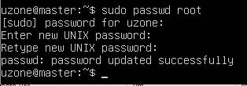

<h1>基于kubeadm的Kubernetes集群部署</h1>

>介绍在 **Ubuntu Server 18.04.2 LTS** 版本上安装 **kubeadm**，
>并利用 **kubeadm** 在 **Ubuntu Server 18.04.2 LTS**上构建一个 **Kubernetes** 测试集群。

<h2 id="1">目录</h2>

[使用Markdown语法增加的跳转到“前言”的链接](#1)

